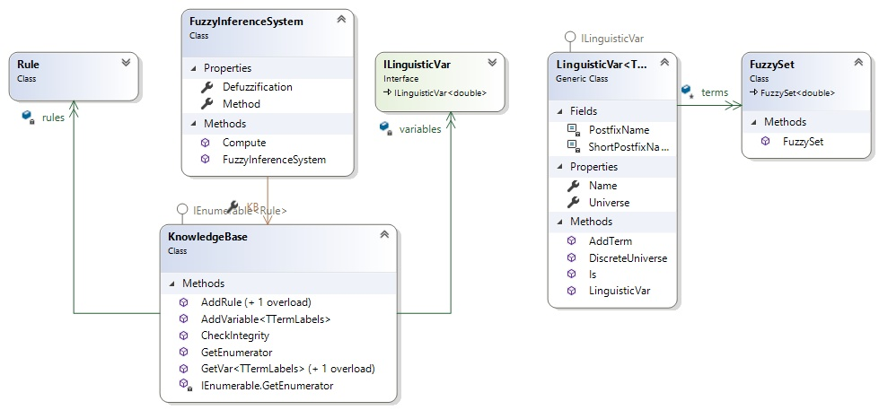
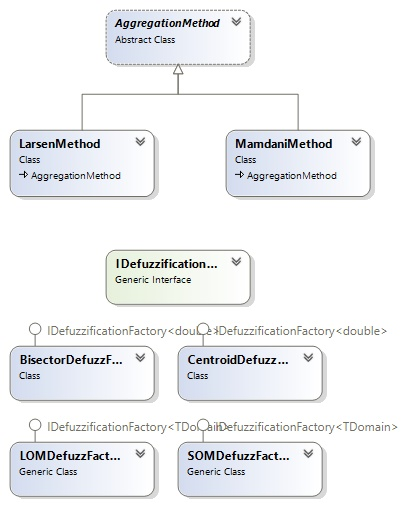

Como parte de este trabajo se ha implementado un Sistema de Inferencia basado en Lógica Difusa, extensible y versatil que permite:

•	Utilizar la mayor parte de las funciones de pertenencia a conjuntos difusos utilizadas (Triangulares, Trapezoidales, Gaussianas, Bell, LeftRight y Sigmoid) y adicionar otras.

•	Crear variables linguísticas y utilizarlas para definir reglas en una base de conocimiento.

•	Utilizar los métodos de agregación de Mamdani y Larsen para evaluar e inferir.También es posibles crear otros métodos y utilizarlos sin hacer modificaciones.

•	Utilizar diferentes métodos de desdifusificación (Centroid, Bisector, LOM y SOM) o agregar otros

